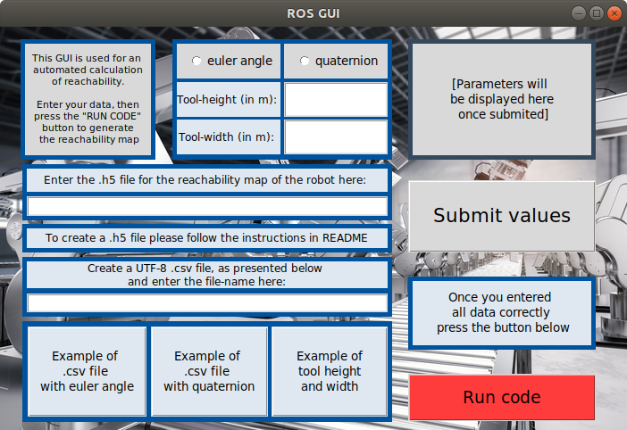

# End-Effector-dependent-Evaluation-of-Task-Executability


Git project for End-Effector-dependent Evaluation of Task Executability by Mobile Robots in Changeable Assembly Stations. 
This project is funded by Deutsche Forschungsgemeinschaft (DFG, German Research Foundation) under Germanys Excellence Strategy – EXC-2023 Internet of Production – 390621612.
The authors are responsible for the content.

#Goal

The goal of this project is calculate possible poses of a robot based on the tools measurements, the goal pose and the reachability map of the robot. Using the map, is possible to find the best pose of the robot by the collection of reachable poses and also the reachability index of each of them.
 
 \page prerequisites Prerequisites 

# Prerequisites:

1. To install required python libraries run:
    ```
    pip3 install pandas numpy scipy numpy-quaternion sympy matplotlib h5py

    pip install tkinter os sys pandas numpy pyrr opencv-python Pillow scipy sympy matplotlib matplotlib

    sudo apt-get install python-imaging-tk python-scipy  python-matplotlib 
    
    python -m pip install numpy-quaternion
    ```

2. Please make sure that your computer/ virtual machine use Ubuntu 18.04 and has both Python 2.7 (to create the reachability maps) and Python 3 (to run this application).

3. Install ROS Melodic http://wiki.ros.org/melodic/Installation/Ubuntu 

4. Install Reuleaux https://gist.github.com/presleyreverdito/3a74d31cb6e8e2c3a1734719b0fcde0c up to step 2.1

5. You can download the xacro file for the robots (to create the reachability map later)<br>
from https://github.com/ros-industrial/abb_experimental branch kinetic-devel (for ABB robots)<br>
from https://github.com/ros-industrial/universal_robot/tree/melodic-devel/ur_description/urdf (for UR robots)

\page application How to Use the Application

# How to Use the Application: 

1. Create the reachability map for your robot and saves it in folder "maps" of this project

2. Create a .csv file for the robot position and task positions (in global coordinate system) as instructed in the GUI, saves it in folder "code"

3. Open the UI from folder "code"

```
cd code
python3 maa_gui.py
```




and insert the required data:<br>

1. Select between quaternion and euler;<br>

2. The tool height and length are measured in meters;<br>

3. The map should be saved on the "maps" inside of spp-maa project folder. And insert their names in the GUI (not their location);<br>

4. Requirements for the input .csv data of tasks: <br>
    - The robot position and the task positions have the form (x,y,z,a,b,c) in which x,y,z are the coordinates and a,b,c, if you are using euler angles. <br>

    - If you are using quaternion: (x, y, z, Xq, Yq, Zq, Wq) where x ,y ,z are the coordinates and Xq, Yq, Zq, Wq are the quaternion values. <br>
    
    - These positions are measured in meter and relative to the global coordinate system.


5. In folder "result", you can find the calculated result in the result.csv file (default case) and its plot in the result.svg file.

On video below, you can see an example of usage of the GUI.


\page createMap Create Map

# Create a reachability map for your robot:
1. Run roscore in background and open a new terminal and navigate to catkin_ws:
```
cd catkin_ws
source devel/setup.bash
```

2. Navigate to the directory storing the .xacro file of your robot and convert this .xacro file into .urdf file (skip this step if you already have the .urdf file):
```
cd (the path to the urdf file)
rosrun xacro xacro.py <your_robot>.xacro > <your_robot>.urdf
```

3. Create the collada file using .urdf file:
```
rosrun collada_urdf urdf_to_collada <your_robot>.urdf <your_robot>.dae
```

4. Generate IK solver:
```
python `openrave-config --python-dir`/openravepy/_openravepy_/ikfast.py --robot=<your_robot>.dae --iktype=transform6d --baselink=1 --eelink=8 --savefile=<ikfast_output_path> 
```
On <ikfast_output_path> you should put the path + name of output file + ".cpp" (e.g folder-path/kr6r700sixx.cpp)

5. If the .cpp file is not created, please fix the bug in the ikfast.py by using the solution in the following link:
(https://github.com/ros-planning/moveit_tutorials/issues/417#issuecomment-673459896)

- The file is located at '/usr/local/lib/python2.7/dist-packages/openravepy/_openravepy_0_9/ikfast.py'

- In order to have the right for changes, open a terminal in the directory containing this file and type:
```
sudo chmod 777 ikfast.py
```

6. Go to /catkin_ws/src/reuleaux-melodic/map_creator/include/map_creator and paste the .cpp file which we just created
Please open kinematics.h which is in the same folder and change the name of .cpp file to the current one.

7. Save the kinematics.h file, then go to your catkin workspace and run catkin build:
```
cd catkin_ws
catkin build
```
8. In the same terminal, where we navigated to the robot urdf file, create the reachability map using:
```
rosrun map_creator create_reachability_map 0.05 <your_robot>.h5
```
You can change the resolution from 0.05 to what ever you want. The recommended resolution is 0.12.
Then you can find the .h5 file in /catkin_ws/src/reuleaux-melodic/map_creator/maps


# Docker

If you want to use the docker, please change the branch.


# Contact:

A.Kluge-Wilkes@wzl-mq.rwth-aachen.de

Laboratory for Machine Tools and Production Engineering WZL of RWTH Aachen 

Chair of Production Metrology and Quality Management

Department Model-based Systems

Group Model-based Assembly Automation


